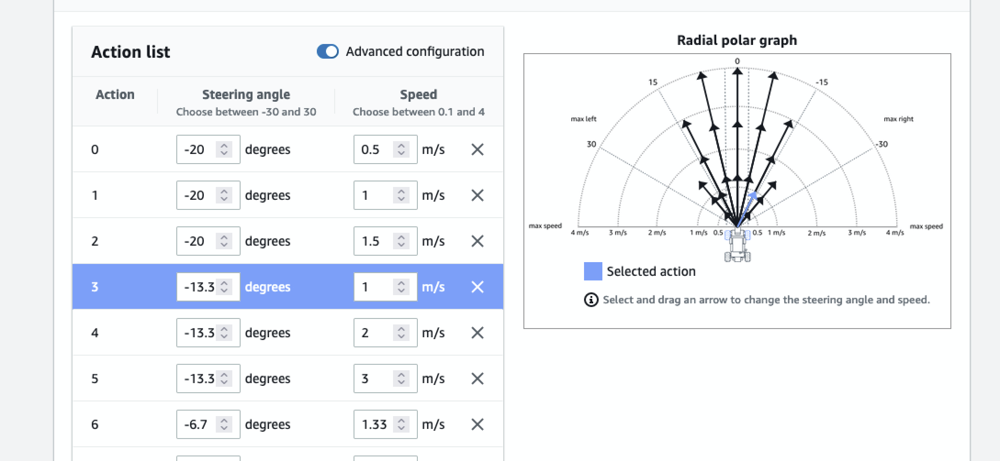

# Deep Racer

Created repo as part of GE Session on 08-17-2021

Docs on reward function
<https://docs.aws.amazon.com/deepracer/latest/developerguide/deepracer-reward-function-input.html>

AWS DeepRacer Slack community
<http://join.deepracing.io/>

GitHub
<https://github.com/aws-samples/aws-deepracer-workshops/>

Free video course
<https://www.aws.training/Details/eLearning?id=32143>

Tips
<https://aws.amazon.com/deepracer/racing-tips/>

Reward function parameters
<https://docs.aws.amazon.com/deepracer/latest/developerquide/deepracer-reward-function-input.html>

## Track

Hot Rod Speedway

## Action list

Trying to narrow down actions.

- not such big turns
- slower when turning hard.



## Pytest

using local env i already have setup.

```shell
pyenv activate idm-integration
```


## Thoughts on models.

### calc-heading-v1 

so just turning to nearest waypoint isn't great, it bounces back and fourth on the track and then on turns runs fast past to the point which takes it off the track.

so after 42 mins.

so how to look ahead. also is the closest waypoint the next waypoint?
is this whats causing fast slow, fast slow?

also we are using heading but not the steering angle.

### 


