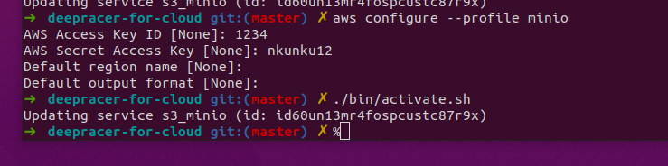

## Local Training

After the Class I setup 


https://docs.nvidia.com/datacenter/cloud-native/container-toolkit/install-guide.html

```
curl https://get.docker.com | sh \
  && sudo systemctl --now enable docker
```

distribution=$(. /etc/os-release;echo $ID$VERSION_ID) \
   && curl -s -L https://nvidia.github.io/nvidia-docker/gpgkey | sudo apt-key add - \
   && curl -s -L https://nvidia.github.io/nvidia-docker/$distribution/nvidia-docker.list | sudo tee /etc/apt/sources.list.d/nvidia-docker.list


sudo apt-get install -y nvidia-docker2


sudo docker run --rm --gpus all nvidia/cuda:11.0-base nvidia-smi


git clone https://github.com/aws-deepracer-community/deepracer-for-cloud.git


Cd deepracer-for-cloud

sudo apt-get install -y jq


Scripts don’t work in zsh.  Use bash instead

DON”T RUN INIT.
./bin/init.sh



Set region to us-east-1

Scripts don’t work in zsh.  Use bash instead
Give - dr-update-env:4: bad math expression: operator expected at `DR_AWS_APP this was due to not using bash.

Change to compose.

#DR_DOCKER_STYLE=swarm
DR_DOCKER_STYLE=compose


source ./activate.sh


aws --endpoint-url http://localhost:9000 s3 ls --profile minio


docker service ls

dr-upload-custom-files

Once file exist, you can start.

dr-start-training


https://github.com/aws-deepracer-community/deepracer-simapp/tree/master/bundle/deepracer_simulation_environment/share/deepracer_simulation_environment/worlds
